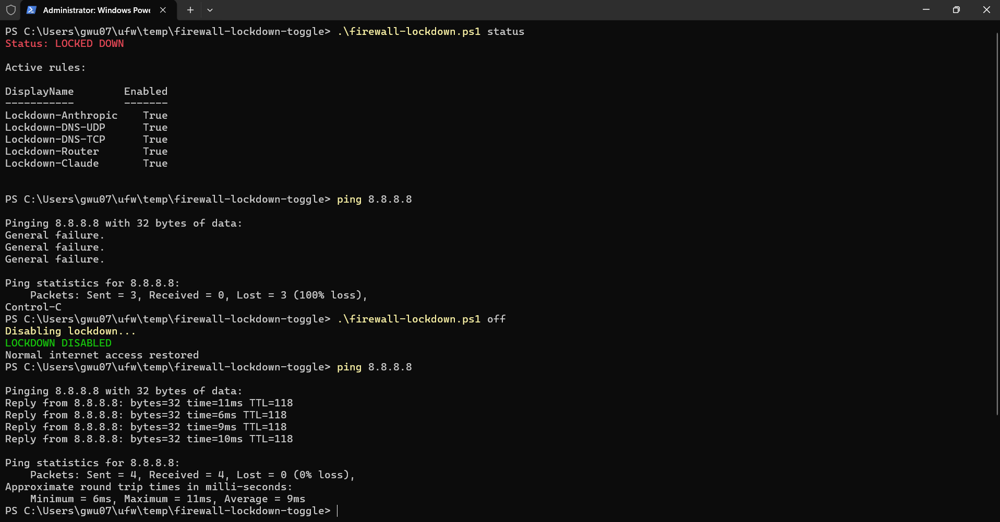

# Firewall Lockdown Toggle (KAV-Gapped Mode)

Air-gapped Windows setup that allows only VPS, and Claude API access.

> optional ability to work in liason with Kaspersky Firewall settings where disabling protection will lockdown connections & enabling will subsequently override this toggle and allow for Internet access.

Otherwise, directly toggle on/off through .ps1

` Optional WSL compatibility integration `​ 



## How It Works

```
┌─────────────────────────────────────────────────────────────┐
│  KAV OFF (Lockdown ON)          │  KAV ON (Lockdown OFF)   │
├─────────────────────────────────┼──────────────────────────┤
│  ✅ VPS (Optional)              │  ✅ Full internet        │
│  ✅ Claude API (Anthropic IPs)  │  ✅ KAV rules active     │
│  ✅ DNS (for resolution)        │  ❌ WSL airgapped        │
│  ✅ Router (192.168.1.1)        │                          │
│  ❌ Everything else blocked     |                          | 
|  ❌ WSL airgapped               │                          │
└─────────────────────────────────┴──────────────────────────┘
```

## Usage

```powershell
# Enable lockdown (air-gapped mode) - If KAV or EDR firewall is present, will override windows firewall settings therefore providing a feature where disabled protection will lockdown connections to only LAN. (An accidental feature)
.\firewall-lockdown.ps1 on

# Disable lockdown (normal internet)
.\firewall-lockdown.ps1 off

# Check current status
.\firewall-lockdown.ps1 status

# Enable WAN connection for WSL (this will conflict with firewall rules and inevitably disable airgap - Run WSL_OFF.bat immediately after package installation or any Internet use on WSL)
.\WSL_ON.bat

# Disable WAN connection for WSL and re-enable airgapped firewall (Airgapped RFC1918 LAN only) 
.\WSL_OFF.bat
```

## What Gets Whitelisted

| Destination | Purpose |
| :--- | :--- |
| `YOUR VPS IP` OPTIONAL (comment out) | Your VPS (SSH, panel) |
| `160.79.104.10` | Anthropic API |
| `34.149.66.165` | Anthropic API |
| `53/udp, 53/tcp` | DNS resolution |
| `192.168.1.1` | Local router |

## Toggle Mechanism

- **Lockdown ON**: blocks all outbound, creates whitelist rules
- **Lockdown OFF**: Removes whitelist rules, allows all outbound
- **KASPERSKY ANTIVIRUS Integration**:  If KAV or EDR firewall is present, will override windows firewall settings therefore providing a feature where disabled protection will lockdown connections to only LAN. (An accidental feature)

## Files

- `firewall-lockdown.ps1` - Main toggle script
- `WSL_ON.bat` - Optional WSL WAN bypass - 
> [!WARNING]
>
> WSL will not work with this firewall setup without disabling it entirely, therefore toggle .bat files are included for WAN access use cases in a convenient fashion.
>
> Always run WSL_OFF.bat and ping 8.8.8.8 with KAV on/off to verify rules are active


## Security Note

Even if malware is on the machine:

- Can't phone home (no internet)
- Can't exfil data (only VPS/Claude allowed)
- SSH keys stay local (can't be sent anywhere else)

## Support

This project is free and open source. If you find it useful, consider supporting continued development:

[](https://buymeacoffee.com/rainfantry)

We work tirelessly to build tools that help people get shit done - no paywalls, no subscriptions, just code that works. Your support helps keep it that way.

### Wall of Legends

> *"I want to go back to the fundamentals, build things myself, break things in a lab, understand them from first principles... What you've shared is worth far more than the amount I'm sending."*
>
> — **@ismailjaweedahmed**, 10-year cybersecurity veteran

> *"For exposing pedo scum. Fan of your work, keep going."*
>
> — **hxpnctrpstr**

> *"For the children.. and also teach me c#nt"*
>
> — **Qwenobi**

---

## Author

**George Wu** - [@rainfantry](https://github.com/rainfantry)


